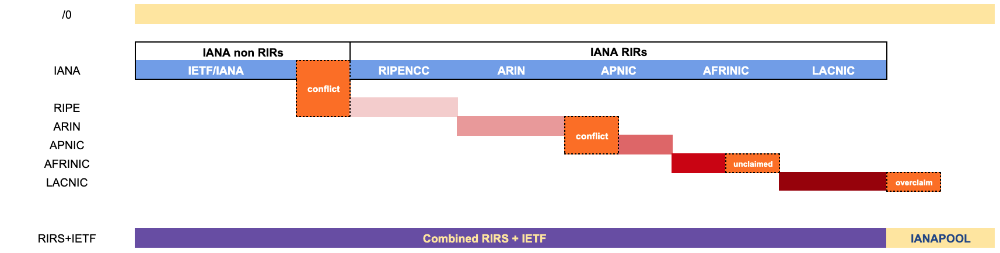

Overview
--------


This NRO Extended Allocations and Assignment reports is a daily updated report
of the distribution of Internet number resources.

The main NRO extended reports format is according to the following specification:
- https://www.nro.net/wp-content/uploads/nro-extended-stats-readme5.txt [1]


Inputs
===========

The daily distribution reports are generated based on delegated extended RIR reports from each of the RIRs.

```
    APNIC   -> "https://ftp.apnic.net/stats/apnic/delegated-apnic-extended-latest",
    AFRINIC -> "https://ftp.afrinic.net/stats/afrinic/delegated-afrinic-extended-latest",
    ARIN    -> "https://ftp.arin.net/pub/stats/arin/delegated-arin-extended-latest",
    LACNIC  -> "https://ftp.lacnic.net/pub/stats/lacnic/delegated-lacnic-extended-latest",
    RIPENCC -> "https://ftp.ripe.net/pub/stats/ripencc/delegated-ripencc-extended-latest",
```

Each RIRs has their own reports specification, but we rely on the facts that their records formats aligned with [1]./

- https://ftp.apnic.net/apnic/stats/apnic/README-EXTENDED.TXT
- https://ftp.afrinic.net/stats/afrinic/README-EXTENDED.txt
- https://ftp.lacnic.net/pub/stats/lacnic/RIR-Statistics-Exchange-Format.txt
- https://ftp.ripe.net/pub/stats/ripencc/RIR-Statistics-Exchange-Format.txt


In addition to that, the original allocation of resources to each RIR is also used:

```
    IANA    -> "https://ftp.apnic.net/pub/stats/iana/delegated-iana-latest",
```

Reports
=======

Reports are generated daily and stored in:
- https://ftp.ripe.net/pub/stats/ripencc/nro-stats/

An subdirectory named `YYYYMMDD` is generated daily under that ftp location.
The `latest` subdirectory is a symbolic link for the latest generated daily data subdirectory.

The main file generated is:
https://ftp.ripe.net/pub/stats/ripencc/nro-stats/latest/nro-delegated-stats
Which is also available from: https://www.nro.net/about/rirs/statistics/

There are several files produced under each daily archive directory:

* `combined-stat`, this report is an alias of the same final result, nro-delegated-stats, where we combine all the RIR statistics  and IANA files.

* `merged-stat`, this report contains the same data as above, except that adjacent resources that fit bit boundary, 
  are merged into one row.  This is different with the standard RIR-Statistic-Exchange format where they might be listed separagely.

* `overclaimed` reports contains the list of records that is declared in RIR's statistics, but in IANA delegated stats
  is declared as ianapool. For example the following resources used to be declared by APNIC but was listed as ianapool 
  on the IANA delegated stats, thus listed as overclaim.
  ```
  apnic|HK|asn|2772|1|20100720|assigned|A91EA623|e-stats
  ```

* `unclaimed` reports contains all the records that is allocated by IANA but not claimed according to RIR's statistics.
  As an example, the following resources are not listed in AFRINIC's RIR Statistics:
    ```
    afrinic|ZZ|ipv6|2c0f:efa9::|32|20221205|reserved|afrinic|e-stats
    afrinic|ZZ|ipv6|2c0f:efaa::|31|20221205|reserved|afrinic|e-stats
    ```
  This indicates that both /32 and /31 IPv6 according to IANA latests delegation  was originally allocated to AFRINIC:
    ```
    iana|ZZ|ipv6|2c00:0000::|12|20061003|allocated|afrinic|iana
    ```
  But not all of these space is  declared in their RIR statistics.

* `conflicts` are if more than one RIRs or IANA claims the same records, example:

    ```
    apnic|ZZ|ipv4|203.0.113.0|256|20230222|reserved|apnic|e-stats
    iana|ZZ|ipv4|203.0.113.0|256|20090714|reserved|ietf|iana

    apnic|ZZ|ipv6|2001:db8::|32|20230222|reserved|apnic|e-stats
    iana|ZZ|ipv6|2001:0db8::|32|20040701|reserved|ietf|iana
    ```
 The resources are listed in APNIC RIR statistics while also listed as reserved on IANA delegated stats.

 Visually each of these files can be illustrated as follows:



Notification
============

Conflicts, overclaimed, and unclaimed are reported to contacts representative from each of the RIRs, if they persisted for more than a configured grace period.


